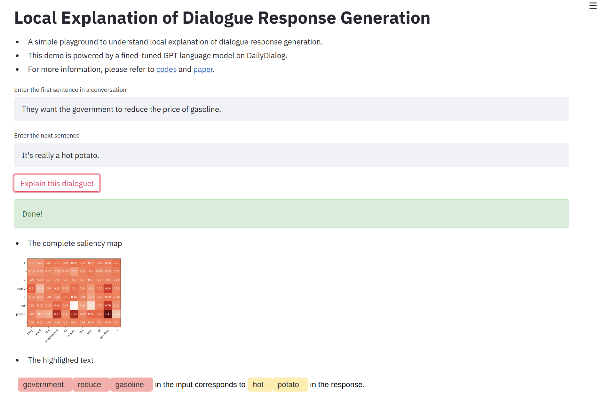

# Local Explanation of Dialogue Response Generation

This repository is the official implementation of [Local Explanation of Dialogue Response Generation](https://arxiv.org/pdf/2106.06528.pdf). 


## Requirements

To install requirements:

```setup
pip install -r requirements.txt
```

## Play Around!
Requirements:
```
pip install streamlit
streamlit hello
pip install st-annotated-text
```
Run:
```
streamlit run streamlit_app.py
```
It will look like this!


## Usage

### Reproduce our results
* Download our used data and model from [Drive](https://drive.google.com/drive/folders/1dXpdH6mPfk9uO6c2cskKJfMJ98bl0_32?usp=sharing)
* To explain dialogue generation models via methods `LERG_S`,`LERG_L`, and baselines `SHAP`, `LIME`, run
```
python explain.py LERG_S <model-dir> <data-path>
```
* After run `explain.py`, get the `<time-stamp>` of saved explanations that stored in format `"%m%d%Y_%H%M%S"`, run
```
python eval.py LERG_S <time-stamp> <plot or not> <model-dir> <data-path>
```

* To explain dialogue generation models via baselines `attn`(attention), `grad`(gradient), `none`(random), run
```
python eval.py attn None <plot or not> <model-dir> <data-path>
```


### Explain your own model and dataset
1. Write your model function in `target_models.py`.
2. Replace the original line `model = GPT()` with your model in `explain.py` and `eval.py`.
3. Run
```
python explain.py LERG_S <model-dir> <data-path>
python eval.py LERG_S <time-stamp> <plot or not> <model-dir> <data-path>
```

### Use as package
import a purtabation model and an explanation method, then can be used in your code as:
```
from perturbation_models import RandomPM
from RG_explainers import LERG_SHAP_log as LERG_S

perturb_f = RandomPM.perturb_inputs
local_exp  = LERG_S(<replace_with_your_model_forward_function>, input, output, perturb_f, your_tokenizer)
phi_set, phi_map, input_segments, output_segments = local_exp.get_local_exp()
```

## Results

Perplexity Changes after removal (PPLC\_R): (Slide with removal rate)
| Method    | 0.1 | 0.2 | 0.3 | 0.4 | 0.5 |
| --------- | --- | --- | --- | --- | --- |
| Random    |  1.0699 | 1.1528 | 1.2317 | 1.3395 | 1.4449 |
| Attention |  1.0307 | 1.0931 | 1.1803 | 1.3106 | 1.479  |
| Gradient  |  1.0578 | 1.1898 | 1.3244 | 1.4751 | 1.6340 |
| LIME      |  1.1342 | 1.3667 | 1.5278 | 1.6807 | 1.8180 |
| SHAP      |  1.1348 | 1.4038 | 1.5890 | 1.7823 | 1.9441 |
| LERG\_L   |  1.1442 | 1.3945 | 1.5554 | 1.7216 | 1.8646 |
| LERG\_S   |  1.2006 | 1.5588 | 1.8038 | 2.0332 | 2.2148 |
               

Perplexity with additives (PPL\_A): (Slide with additive rate)
| Method    | 0.5 | 0.6 | 0.7 | 0.8 | 0.9 |
| --------- | --- | --- | --- | --- | --- |
| Random    |  13.1789 | 14.0605 | 15.3738 | 16.5017 | 17.8391 |
| Attention |  13.4672 | 14.1226 | 14.9678 | 15.7989 | 16.9803 |
| Gradient  |  12.7876 | 13.3019 | 14.1291 | 15.0506 | 16.1721 |
| LIME      |  12.3468 | 12.5363 | 13.0447 | 13.5929 | 14.3374 |
| SHAP      |  12.1357 | 12.2112 | 12.5584 | 12.9923 | 13.6296 |
| LERG\_L   |  12.0076 | 12.1196 | 12.5866 | 13.1717 | 13.8904 |
| LERG\_S   |  11.5665 | 11.4350 | 11.5816 | 11.9123 | 12.4341 |

## Citation

```
@inproceedings{tuan2021local,
  title={Local Explanation of Dialogue Response Generation},
  author={Tuan, Yi-Lin and Pryor, Connor and Chen, Wenhu and Getoor, Lise and Wang, William Yang},
  booktitle={arxiv},
  year={2021},
}
```
